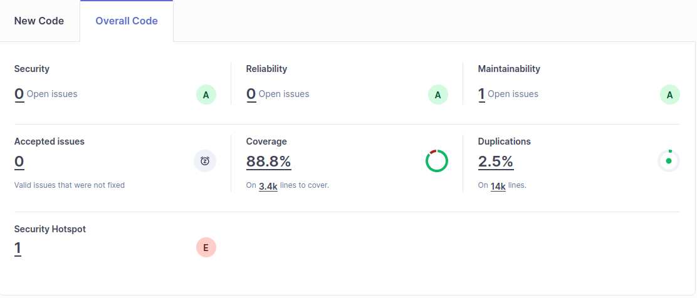
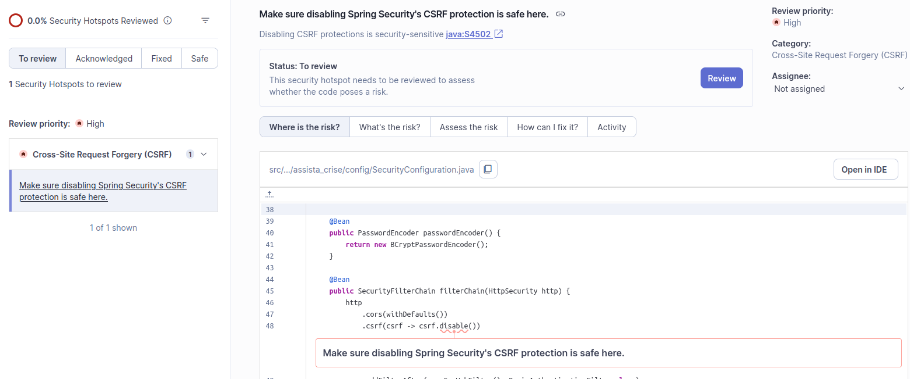

# Comments

## Report notes

### Maintainability

=> Simply a comment who indicate: `<!-- <removeUnusedImports/> -->` in `APP/pom.xml`.

### Security Hotspot

It's a verification to do.

### Duplication

It's only for database, DTO files & domain files, it's not very important to notify that it's normal.

### Coverage

Problems of coverage are on some DTO files or domain files or repository files. The most important problems of coverage are on configuration files so it's normal to have a bad coverage on these files.

## Redacted report (in french)

### Analyse de la qualité du code avec SonarQube

#### Résultats globaux

Le tableau ci-dessous synthétise les métriques relevées à l'issue de l'analyse :

| Catégorie | Métrique | Valeur | Note |
| --- | --- | --- | --- |
| **Fiabilité** | Bugs | 0 | A |
| **Sécurité** | Vulnerabilities | 0 | A |
| | Security Hotspots | 1 (0 % reviewed) | E (hotspot) |
| **Maintenabilité** | Code Smells | 0 | A |
| | Technical Debt | 5 minutes | — |
| | Technical Debt Ratio | 0,0 % | A |
| **Couverture** | Coverage | 88,8 % | — |
| **Duplications** | Lignes dupliquées | 2,5 % (14 blocs) | — |
| **Taille** | Lines of Code (LOC) | 10 083 | — |
| | Total lines | 14 233 | — |
| | Statements | 2 469 | — |
| | Files / Classes / Functions | 160 / 148 / 1 122 | — |
| **Complexité** | Cyclomatic Complexity | 1 464 | — |
| | Cognitive Complexity | 386 | — |

#### Analyse par axe

##### Fiabilité et sécurité

Aucun bug ni vulnérabilité n'est détecté. Un unique **Security Hotspot** est remonté (non revu) : il s'agit du fichier `SecurityConfiguration.java`. Un hotspot n'est **pas une vulnérabilité avérée** mais un point nécessitant une revue humaine ; dans notre cas il est attendu et lié à la configuration initiale.

##### Maintenabilité

La dette technique de **5 minutes** pour 10 083 lignes de code donne un ratio de **0,0 %**, ce qui place le projet à la note maximale **A**. Aucun code smell n'est détecté. Ce résultat est attendu, le code analysé est essentiellement constitué :

- d'**entités JPA** générées (`domain/`),
- de **DTOs** et **mappers MapStruct** (`service/dto/`, `service/mapper/`),
- de **repositories Spring Data** (interfaces uniquement),
- de **contrôleurs REST CRUD** standardisés (`web/rest/`),
- et de la configuration Spring Boot fournie par JHipster.

L'ensemble suit des patrons éprouvés et bénéficie de la maturité des générateurs JHipster, audités par leur communauté.

##### Couverture de tests

La couverture atteint **88,8 %**, un score très élevé. Elle est portée par :

- **109 tests unitaires** Surefire et **324 tests d'intégration** Failsafe côté Java, instrumentés par JaCoCo et couvrant l'intégralité du CRUD pour chacune des 7 entités du modèle (`Personne`, `EquipeCrise`, `RapportCrise`, `Mission`, `Crise`, `Notification`, `User`) ;
- **424 tests Vitest** côté frontend Vue 3.

> ⚠️ **Précision importante** : le scanner indique « 2 languages detected » (Java et XML uniquement). Le frontend TypeScript/Vue n'a **pas été analysé** par SonarQube lors de cette exécution, vraisemblablement parce que le plugin JS/TS n'est pas chargé sur cette installation Community Build, ou parce que les sources `src/main/webapp/app/**` ne sont pas explicitement incluses dans `sonar.sources`. Le 88,8 % de couverture porte donc essentiellement sur le code Java.

##### Duplications

**2,5 % de lignes dupliquées** (14 blocs) sont identifiées. Ce taux modeste est intrinsèque au code généré : les contrôleurs REST des 7 entités partagent des patrons quasi-identiques (gestion des `ResponseEntity`, des `Optional`, des en-têtes HTTP `Location`), de même que les classes de test d'intégration. Il s'agit d'une duplication **structurelle assumée** par JHipster, qui privilégie la lisibilité indépendante de chaque ressource à la factorisation.

##### Complexité

Avec **1 464** de complexité cyclomatique répartie sur **1 122 fonctions**, la moyenne s'établit à **1,30 par fonction** — un excellent score, traduisant des méthodes courtes et linéaires (getters/setters, méthodes CRUD à un seul chemin d'exécution dominant). La **complexité cognitive de 386** (≈ 0,34 par fonction) confirme la grande lisibilité du code : peu d'imbrication, peu de logique conditionnelle complexe.

#### Discussion critique

Ces résultats — toutes les notes à **A**, dette technique quasi nulle, couverture à 88,8 % — donnent l'image d'un projet de très haute qualité. Cette image est **partiellement trompeuse**, et il est important de la nuancer :

1. **Le code analysé est exclusivement généré par JHipster.** Il représente l'ossature technique de l'application (persistance, exposition REST, sécurité JWT, internationalisation), mais **ne contient encore aucune logique métier propre à Assista Crise**. La gestion des crises, l'affectation dynamique d'équipes, le calcul de priorité des missions ou la production de rapports de crise — c'est-à-dire le cœur fonctionnel — ne sont pas implémentés. Or c'est précisément ce code-là qui concentrera, à terme, la complexité cyclomatique élevée, les éventuels bugs et la dette technique.

2. **Les tests générés couvrent du code générique.** Les 324 tests d'intégration valident essentiellement le bon fonctionnement du CRUD JPA et des sérialisations DTO ↔ Entity. Ils ne testent pas de règles métier (puisqu'il n'y en a pas encore). Un taux de couverture de 88,8 % à ce stade est donc moins révélateur qu'il ne le paraît.

3. **Le frontend n'a pas été audité.** L'analyse Sonar telle qu'exécutée laisse hors de portée plus de 400 fichiers TypeScript/Vue, qui contiendront pourtant l'essentiel de l'expérience utilisateur (formulaires de saisie de crise, tableaux de bord, dashboards temps réel). C'est une limite à corriger pour une analyse complète.

> Tests FrontEnd accessibles dans `APP/target/test-results/TESTS-results-vitest.xml`
> > Tous les tests passent, pas d'analyse Sonar dessus comme dit ci-dessus.

#### Conclusion

Le projet présente, à ce stade de squelette JHipster, une **qualité technique excellente** sur les axes mesurés par SonarQube : aucun bug, aucune vulnérabilité, dette technique négligeable, complexité maîtrisée et couverture de tests élevée sur la partie Java. Ces résultats valident la qualité de l'outillage JHipster et la solidité du socle généré.
